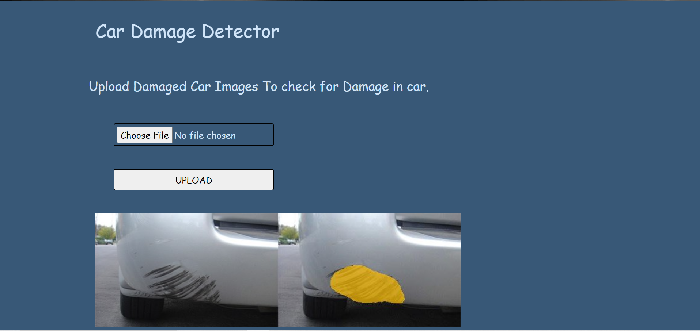
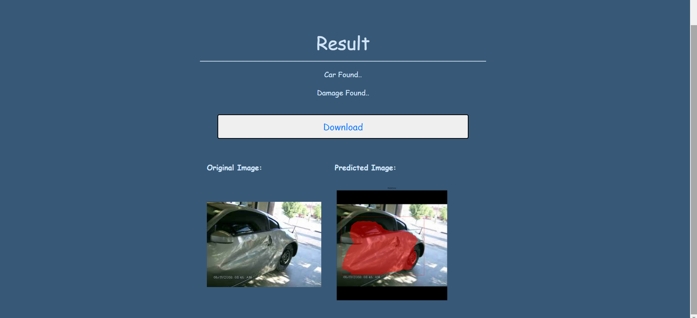

# Car-Damage-Detection-using-mask-rcnn
Identifies and locates the damages in car using mask-rcnn
# Table of content:
- [DEMO]()
- [OVERVIEW]() 
- [BUSINESS PROBLEM]()
- [TECHNICAL ASPECT]()
- [COLLECTING DATA]()
- [INSTALLATION]()
- [DETECTING CAR IN IMAGE]()
- [DETECTING DAMAGE IN CAR]()
- [LOCATING DAMAGE IN CAR]()
- [DEPLOYMENT]()
- [WEBAPP]()
- [CONCLUSION]()

# Demo:

# Overview:
This is a Car Damage Detection application which can detect if a car is damaged or not using Artificial Intelligence.
Here, we can input an image or a set of images in compressed(zip) file,it will identify if there is a car in image and if the car is damaged and then it locates the damage in the car and displays the result as an output. 
For zip files, it extracts all the images in file, and for each image it detects the damage and result the images with damage located on them in a zip file.
# Business Problem:
Given Image of a car we have to find out :
(i) The given image has a car
(ii) The car is damaged or not.
(iii) If the car is damaged then locate the damage
Mapping the problem into Deep Learning Model:
For detecting the car in the image and detecting damage in the car, it will be a binary
classification problem. And for dealing with images as input CNN(Convolutional Neural
Network) will be used.

# Technical Aspect:
........
# Collecting Data:
Damaged Car images are downloaded from the internet and further divided into train,
test and validation data.
For this problem we have 2 types of data:
- For detecting cars in image we have some images containing cars and some not
containing cars.
- For detecting damage in cars we have train and validation folders of images containing
damaged and non-damaged cars.
- For locating damage in the car we have 300 train, 300 test and 160 val folders of damaged car
images.

# Installation:
To install the required packages and libraries, run this command in the project directory after [cloning](https://github.com/matterport/Mask_RCNN.git) the repository:
 
  pip install -r requirements.txt
# [Detecting Car in Image:](https://github.com/kajal1301/car_damage_detection/blob/main/Car_detection.ipynb)
- Libraries used: numpy, keras, IPython
- Model used: VGG16
Using pre-trained VGG16 model on imagenet:
To compare the accuracy, I used various models like VGG16, VGG19, ResNet50, InceptionV3,
xception and compared accuracy of all the models. VGG16 was giving better accuracy than all
other models.
I used the VGG16 model to get the prediction of cars in images.
I calculated top predictions of images and stored them in a dictionary in sorted order.
If for any image its prediction is same as the top predictions stored in categ_count dict then the
image contains the image.

# [Detecting Damage in Car:](https://github.com/kajal1301/car_damage_detection/blob/main/Damage%20identification.ipynb)
After detecting car in image, to find whether car is damaged or not.
For this I divided the dataset into training and validation data and i further divided the
dataset into damaged and non-damaged dataset.
After it i classified image classification using VGG16 model and all the features as
bottleneck features.
After that I trained these extracted features with sequential model. (transfer Learning)
After this i Trained the classifier by modifying the weights of above models-- Fine Tuning.
I defined checkpoints specifying when to save the model to make the training process
more efficient.
This helps in getting better accuracy.
After training the model, I load the model to evaluate its performance by calculating a
confusion matrix. Then I checked for damage in the car with the is_damaged function.
Here I predicted damage in each image and if the prediction is greater than 50% the car
is referred to damaged.

# [Locating Damage in Car:](https://github.com/kajal1301/car_damage_detection/blob/main/damage_detection_mrcnn%20(3).ipynb)
Damage in the car can be located with 2 ways:
● By drawing a Bounding box around the damage.
● Mask a polygon over the damage.
For this I used [VGG Image Annotator](https://www.robots.ox.ac.uk/~vgg/software/via/) to annotate the training images.
Initialize the path of custom directory where i have stored the dataset.
Loaded the dataset in custom/train folder
Displayed the top masks of damage located in the random image of car.
Create a mask-rcnn model in inference mode
Load the weights of pre-trained mrcnn model
After loading the model weights I tested with the images I kept in the custom/test folder.
I read every image in the folder then tested if it contained a car or not.
If the image contains a car then it detects if the car is damaged or not.
If the car is damaged then it will draw a bounding box and mask over the damage found
in the car.
If there is no car in the image or if the car is not damaged then it wont detect any
damage by drawing a bounding box or mask over it.
# [Deployment:](https://github.com/kajal1301/car_damage_detection/blob/main/car_damage.ipynb)
I Deployed this model using flask
# Web app:

## For Image:
   
## For Zip file:
   
   
# CONCLUSION
Using Mask-RCNN is able to locate the damage in the image of the car. And it is also
detecting easily whether there is a scratch or not.
VGG16 model trained on imagenet dataset is showing better accuracy then all other
models in detecting car in image and damage in cars.

